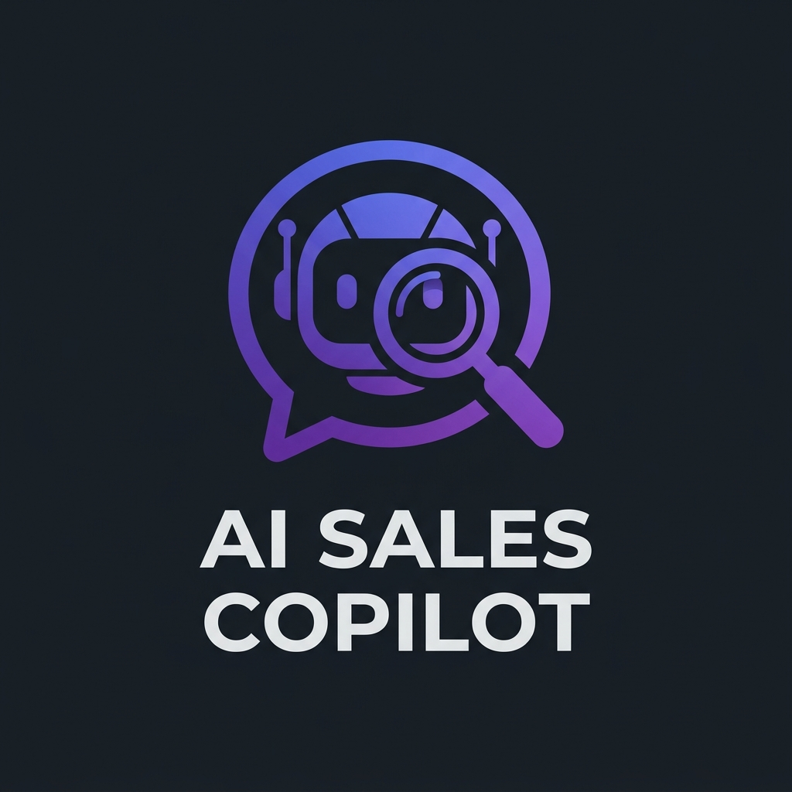
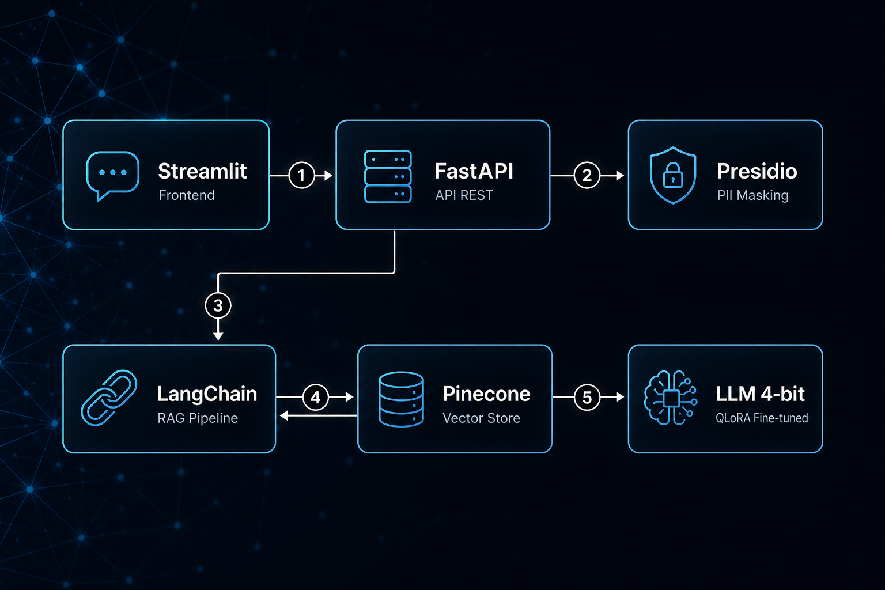

# 🤖 AI Sales Copilot

<p align="center">
  
</p>

<br>

<p align="center">
  
  
  
  
  
  
</p>

> Assistente RAG corporativo com LLM open-source quantizado em 4-bit, fine-tuning via QLoRA, mascaramento automático de PII e interface de chat moderna — rodando 100% local em hardware consumer.

---

## 👨‍💻 Autor

- <a href="https://www.linkedin.com/in/guilherme-ferreira-santos-94619b23a/">Guilherme Ferreira Santos</a> — Engenheiro de Dados e Automação | Analytics | AI & DevOps

---

## 📜 Descrição

O **AI Sales Copilot** é um agente de inteligência artificial projetado para atuar como um assistente inteligente de vendas e suporte técnico. Ele permite que qualquer colaborador faça perguntas em linguagem natural sobre produtos, serviços, políticas internas ou regras fiscais, e receba respostas precisas baseadas na documentação real da organização.

O sistema utiliza a arquitetura **RAG (Retrieval-Augmented Generation)** para buscar trechos relevantes dos documentos internos em um banco vetorial (**Pinecone**), orquestrado pelo **LangChain**, e gerar respostas contextualizadas por um modelo de linguagem open-source (**Qwen2.5** ou **Llama-3.2**) rodando localmente com quantização em **4-bit** via `bitsandbytes`.

Antes de qualquer processamento, os dados do usuário passam por uma camada de **mascaramento de PII** (Informações Pessoais Identificáveis) usando o **Presidio** da Microsoft, garantindo conformidade com a LGPD e boas práticas de segurança em IA.

O modelo base é refinado com **QLoRA (Quantized Low-Rank Adaptation)** para aprender o vocabulário e o contexto específicos do domínio de negócio, sem a necessidade de hardware corporativo — bastando uma GPU consumer com 4GB de VRAM.

Toda a solução é exposta via **FastAPI** como uma API RESTful e consumida por uma interface de chat interativa construída com **Streamlit**.

### ✨ Features

- 🔍 **RAG Pipeline** — Busca semântica em documentos internos via Pinecone
- 🛡️ **PII Masking** — Proteção automática de CPF, CNPJ, e-mail, telefone e nomes
- ⚡ **Quantização 4-bit** — Modelo LLM otimizado para rodar em GPUs com 4GB VRAM
- 🎯 **Fine-tuning QLoRA** — Adaptação do modelo ao vocabulário do seu domínio
- 🚀 **API RESTful** — Backend robusto com FastAPI e documentação Swagger
- 💬 **Chat Interface** — Frontend moderno e interativo com Streamlit
- 📊 **Source Attribution** — Cada resposta indica as fontes documentais utilizadas
- 🔒 **LGPD Compliant** — Dados sensíveis nunca chegam ao modelo de IA

---

## 🏗️ Arquitetura

<p align="center">
  
</p>

```
┌─────────────┐     ┌──────────────┐     ┌───────────────┐
│  Streamlit   │────▶│   FastAPI     │────▶│  PII Masking  │
│  (Frontend)  │◀────│   (Backend)   │     │  (Presidio)   │
└─────────────┘     └──────┬───────┘     └───────┬───────┘
                           │                     │
                           ▼                     ▼
                    ┌──────────────┐     ┌───────────────┐
                    │  LangChain   │────▶│   Pinecone    │
                    │  Orchestrator│     │  (VectorDB)   │
                    └──────┬───────┘     └───────────────┘
                           │
                           ▼
                    ┌──────────────┐
                    │  LLM Local   │
                    │  4-bit QLoRA │
                    └──────────────┘
```

**Fluxo:**
1. Usuário envia pergunta pelo **Streamlit**
2. **FastAPI** recebe e encaminha ao **Presidio** para mascarar PII
3. Pergunta limpa vai ao **LangChain**, que busca contexto relevante no **Pinecone**
4. Contexto + pergunta são enviados ao **LLM quantizado** (4-bit) para geração
5. Resposta retorna ao usuário com indicação das fontes utilizadas

---

## 🛠️ Tech Stack

| Camada | Tecnologia | Função |
|--------|-----------|--------|
| **Frontend** | Streamlit | Interface de chat interativa |
| **Backend** | FastAPI + Uvicorn | API RESTful com docs Swagger |
| **Orquestração** | LangChain | Pipeline RAG e prompt management |
| **Vector Store** | Pinecone (Free Tier) | Armazenamento e busca de embeddings |
| **Embeddings** | sentence-transformers | Conversão de texto em vetores |
| **LLM** | Qwen2.5-1.5B / Llama-3.2-1B | Geração de respostas |
| **Quantização** | bitsandbytes | Compressão do modelo para 4-bit |
| **Fine-tuning** | PEFT + TRL (QLoRA) | Adaptação ao domínio específico |
| **Segurança** | Presidio (Microsoft) | Mascaramento de dados pessoais |
| **Linguagem** | Python 3.11+ | Toda a aplicação |

---

## 📁 Estrutura de pastas

```
project-root/
├── README.md                    # Este documento
├── PROJECT_BLUEPRINT.md         # Especificação técnica completa
├── requirements.txt             # Dependências Python
├── .env.example                 # Template de variáveis de ambiente
├── docker-compose.yml           # (Opcional) Deploy containerizado
│
├── assets/                      # Recursos visuais (logo, screenshots)
│
├── data/
│   ├── raw/                     # Documentos originais (PDFs, TXTs)
│   ├── processed/               # Chunks processados
│   └── training/
│       └── dataset.jsonl        # Dataset de fine-tuning QLoRA
│
├── src/
│   ├── config.py                # Configurações centralizadas
│   ├── ingestion/               # Pipeline de ingestão de documentos
│   │   ├── loader.py            # Carrega PDFs/docs
│   │   ├── chunker.py           # Text splitting
│   │   └── embedder.py          # Gera embeddings + upsert Pinecone
│   ├── rag/                     # Pipeline RAG
│   │   ├── retriever.py         # Busca vetorial
│   │   ├── chain.py             # RAG chain (LangChain)
│   │   └── prompts.py           # Templates de prompt
│   ├── security/                # Camada de segurança
│   │   ├── pii_masker.py        # Mascaramento com Presidio
│   │   └── pii_unmasker.py      # Restauração pós-resposta
│   ├── model/                   # Gerenciamento do LLM
│   │   ├── loader.py            # Carrega modelo quantizado
│   │   └── quantize.py          # Config bitsandbytes 4-bit
│   ├── training/                # Fine-tuning
│   │   ├── prepare_dataset.py   # Formata dados para SFT
│   │   ├── qlora_train.py       # Script de treinamento QLoRA
│   │   └── merge_adapter.py     # Merge LoRA weights
│   └── api/                     # Backend
│       ├── main.py              # FastAPI app
│       ├── routes.py            # Endpoints
│       └── schemas.py           # Pydantic models
│
├── frontend/
│   └── app.py                   # Streamlit chat interface
│
├── scripts/                     # Scripts auxiliares
│   ├── ingest_documents.py      # CLI: processa e indexa docs
│   ├── train_model.py           # CLI: executa fine-tuning
│   └── run_all.py               # CLI: sobe API + frontend
│
├── tests/                       # Testes automatizados
│   ├── test_pii_masker.py
│   ├── test_retriever.py
│   └── test_api.py
│
└── docs/                        # Documentação adicional
    ├── architecture_diagram.png
    └── setup_guide.md
```

---

## 🔧 Como executar o código

### Pré-requisitos

| Requisito | Versão Mínima | Observação |
|-----------|--------------|------------|
| Python | 3.11+ | Gerenciador de pacotes `pip` |
| GPU NVIDIA | Driver 525+ | CUDA 11.8+ compatível |
| VRAM | 4 GB | Mínimo para modelo 4-bit |
| Git | 2.30+ | Controle de versão |
| Conta Pinecone | Free Tier | [pinecone.io](https://www.pinecone.io/) |
| Conta Hugging Face | Free | [huggingface.co](https://huggingface.co/) |

### Instalação

```bash
# 1. Clone o repositório
git clone https://github.com/GiFiSi/Ai-sales-copilot.git
cd Ai-sales-copilot

# 2. Crie e ative o ambiente virtual
python -m venv .venv
# Windows:
.venv\Scripts\activate
# Linux/Mac:
source .venv/bin/activate

# 3. Instale as dependências
pip install -r requirements.txt

# 4. Instale o PyTorch com suporte a CUDA (ajuste a versão conforme sua GPU)
pip install torch --index-url https://download.pytorch.org/whl/cu118

# 5. Configure as variáveis de ambiente
cp .env.example .env
# Edite o .env com suas chaves (Pinecone, HuggingFace)

# 6. Baixe o modelo de NLP do spaCy (para PII)
python -m spacy download pt_core_news_sm
```

### Execução por Fase

#### Fase 1 — Ingestão de Documentos
```bash
# Coloque seus PDFs/documentos em data/raw/
python scripts/ingest_documents.py
```

#### Fase 2 — Fine-tuning QLoRA (Opcional)
```bash
# Edite data/training/dataset.jsonl com seus exemplos
python scripts/train_model.py
```

#### Fase 3 — Subir a Aplicação
```bash
# Opção A: Tudo junto
python scripts/run_all.py

# Opção B: Separado
uvicorn src.api.main:app --host 0.0.0.0 --port 8000  # Backend
streamlit run frontend/app.py                          # Frontend
```

### Uso da API

```bash
# Health check
curl http://localhost:8000/api/v1/health

# Enviar pergunta
curl -X POST http://localhost:8000/api/v1/chat \
  -H "Content-Type: application/json" \
  -d '{"message": "Qual o sombreamento da tela modelo X?"}'
```

---

## 📊 Métricas de Performance

| Métrica | Meta | Hardware Ref. |
|---------|------|---------------|
| VRAM Usage (inferência) | < 3.5 GB | GTX 1650 4GB |
| Latência média por resposta | < 5 segundos | — |
| PII Detection Rate | > 95% | — |
| RAG Relevance | > 80% | Avaliação manual |
| Throughput | > 10 tokens/s | — |
| Tempo de fine-tuning | < 2 horas | 50 exemplos |

---

## 🗃 Histórico de lançamentos

* 0.1.0 - XX/XX/2025
    * Primeira versão: RAG pipeline + PII masking + modelo quantizado + interface Streamlit

---

## 🗺️ Roadmap

- [ ] Suporte a múltiplos idiomas
- [ ] Histórico de conversas persistente
- [ ] Dashboard de analytics (perguntas mais frequentes)
- [ ] Autenticação de usuários (OAuth2)
- [ ] Deploy containerizado com Docker Compose
- [ ] Suporte a streaming de respostas (SSE)
- [ ] Avaliação automatizada de qualidade (RAGAS)

---

## 📋 Licença

Este projeto está licenciado sob a [MIT License](LICENSE).

```
MIT License — Copyright (c) 2025

Permission is hereby granted, free of charge, to any person obtaining a copy
of this software and associated documentation files (the "Software"), to deal
in the Software without restriction, including without limitation the rights
to use, copy, modify, merge, publish, distribute, sublicense, and/or sell
copies of the Software.
```
